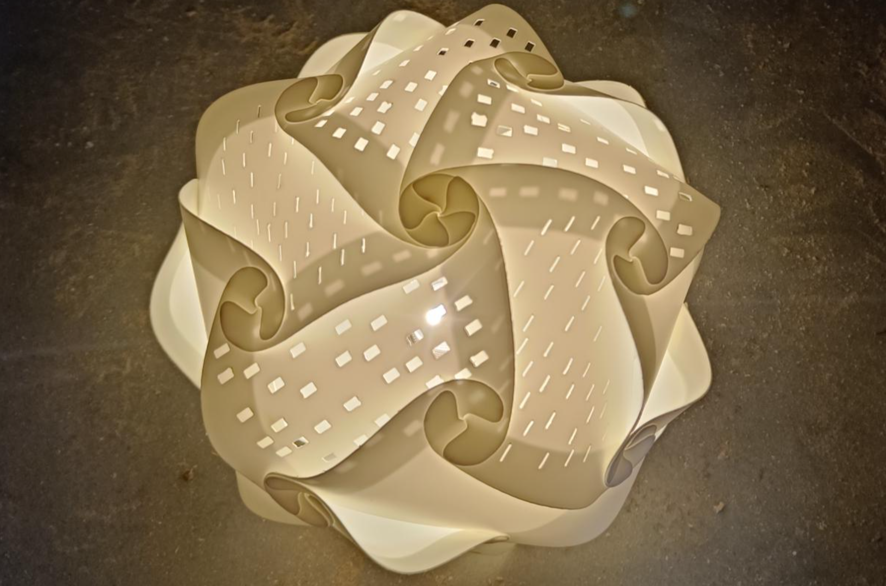

# Nerdland
*By: Lore Brosens, Bas Baccarne, Yannick Christiaens & Simon De Boever*   


This repo covers the set-up of the nerdland installation. This introduces nerds into 4 domains:
- **Interaction Design**: Children can create their own paramertric design with an Arduino-controlled input device
- **Computational Design**: This device feeds a firefly + grasshopper script that generates patterns in a predefined format
- **Advanced manufacturing**: These shapes are exported as SVG files and laser cutted
- **Design for Assembly**: These personalised fragments can be assembled into a night lamp

## Interaction Design
### Components
- [Arduino Nano](https://store.arduino.cc/products/arduino-nano)
- [Grove Thumbstick](https://wiki.seeedstudio.com/Grove-Thumb_Joystick/)
- [Grove Gesture Sensor 1.0](https://wiki.seeedstudio.com/Grove-Gesture_v1.0/)
- [Grove UltraSonic Ranger](https://wiki.seeedstudio.com/Grove-Ultrasonic_Ranger/)
- [4 arcade buttons](https://www.gotron.be/componenten/schakelmateriaal/schakelaars-en-drukknoppen/arcade-knoppen/lichtgevende-arcade-drukknop-30mm-groen.html)
- [Case](https://a360.co/4drFMZX)
- [Joystick](https://a360.co/44EoTHn)
- Mini USB Cable
### Set-up
- Connect the thumbstick to A0
- Connect the Gesture sensor to I2C
- Connect the distance sensor to A2
- Connect button 1 to D4
- Connect button 2 to D6
- Connect button 3 to A2
- Connect button 4 to A6 
- Upload the [Arduino code](/tests/arduino/integration.ino)
- The arduino writes the data to the Serial Port in the folowing format
  ```x_axis_thumb|y_axis_thumb|x_axis_gesture|y_axis_gesture|distance```
- [ ] Case design [*Bas en Yannick*]
- [ ] to do: add reset routine (incl. defaults params)

## Computational Design
- This Serial Data is read by Firefly and translated into computaional commands
- [This example code](tests/grasshopper/grasshopper_testscript.gh) shows how the data is processed in Grasshopper
- [ ] to do: create Grasshopper script for night lamp [*Yannick*]
- [ ] to do: calibrate signal ranges to match parameters [*Bas*]
      
## Advanced Manufacturing
- The Grasshopper result is exported to an SVG and stored on a USB stick
- The USB stick is used to print the design using a laser cutter
- Material:
## Design for Assembly
- Assembly movie
- Examples

## End result

