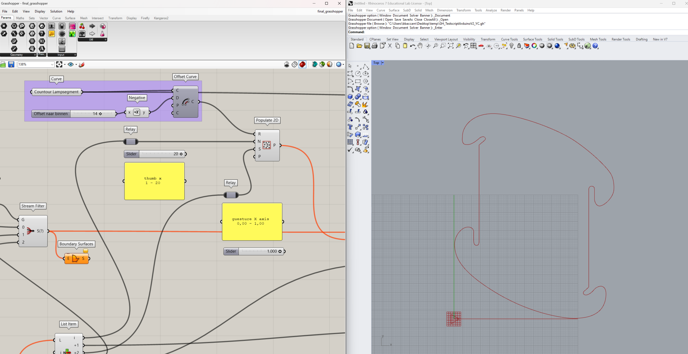

# Nerdland
*By: Lore Brosens, Bas Baccarne, Yannick Christiaens & Simon De Boever*   


This repo covers the set-up of the [nerdland](https://www.nerdlandfestival.be/) installation. This introduces nerds into 4 domains:
- **Interaction Design**: Children can create their own paramertric design with an Arduino-controlled input device
- **Computational Design**: This device feeds a firefly + grasshopper script that generates patterns in a predefined format
- **Advanced manufacturing**: These shapes are exported as SVG files and laser cutted
- **Design for Assembly**: These personalised fragments can be assembled into a night lamp

## Interaction Design
### Components
- [Arduino Nano](https://store.arduino.cc/products/arduino-nano)
- [Grove Shield for Arduino Nano](https://wiki.seeedstudio.com/Grove_Shield_for_Arduino_Nano/)
- [Grove Thumbstick](https://wiki.seeedstudio.com/Grove-Thumb_Joystick/)
- [Grove Gesture Sensor 1.0](https://wiki.seeedstudio.com/Grove-Gesture_v1.0/)
- [Grove UltraSonic Ranger](https://wiki.seeedstudio.com/Grove-Ultrasonic_Ranger/)
- [4 arcade buttons](https://www.gotron.be/componenten/schakelmateriaal/schakelaars-en-drukknoppen/arcade-knoppen/lichtgevende-arcade-drukknop-30mm-groen.html)
- [Case](https://a360.co/4drFMZX)
- [Joystick](https://a360.co/44EoTHn)
- Mini USB Cable
### Set-up
- Connect the thumbstick to A0
- Connect the Gesture sensor to I2C
- Connect the distance sensor to D2
- Connect button 1 to D5
- Connect button 2 to D7
- Connect button 3 to A3
- Connect button 4 to A2 
- Upload the [Arduino code](nerdland.ino)
- The arduino writes the data to the Serial Port in the folowing format
  ```x_axis_thumb|y_axis_thumb|x_axis_gesture|y_axis_gesture|distance```
      
## Computational Design
- This Serial Data is read by [Firefly](https://www.food4rhino.com/en/app/firefly) and translated into computaional commands in [Grasshopper](https://www.grasshopper3d.com/)
- [This Grasshopper script](grasshopper.gh) shows how the data is processed in Grasshopper
  

## Advanced Manufacturing
- The Grasshopper result is baked and exported to an SVG
- The SVG file is printed on a laser cutter using [lightburn](https://lightburnsoftware.com/)
- Material: HDPE Matte/Matte Sheets
## Design for Assembly
- The bottom parts are preprinted
- The bottom fits a [small led tea light](https://www.amazon.com.be/-/en/Afoosoo-Flameless-Battery-Waterproof-Christmas/dp/B0BV1HZ5NH/ref=asc_df_B0BV1HZ5NH/)
- The top has 5 personalized segments
- Assembly movie

## End result

